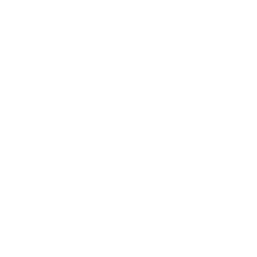
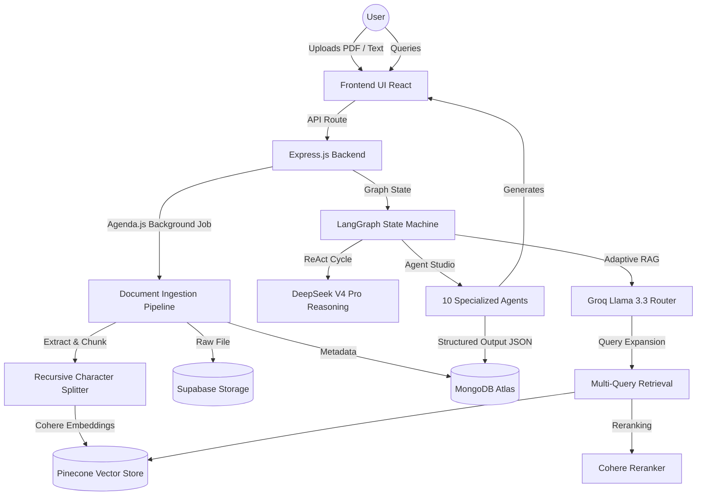

<div align="center">

<br/>


<br/><br/>

#  NoteAtlas

### An AI-native knowledge workspace for deep document intelligence,<br/>research automation, and agent-powered learning.

<br/>

[](https://react.dev)
[](https://nodejs.org)
[](https://www.typescriptlang.org)
[](https://www.langchain.com/langgraph)
[](https://fireworks.ai)

<br/>

**Upload documents · Ask questions · Visualize ideas · Listen anywhere**

<br/>

[Overview](#-overview) · [Why NoteAtlas](#-why-noteatlas) · [vs. NotebookLM](#-noteatlas-vs-notebooklm) · [Features](#-core-features) · [Tech Stack](#-tech-stack) · [Getting Started](#-getting-started)

<br/>

</div>

---

## 📖 Overview

NoteAtlas turns static documents into a living knowledge system.

Upload PDFs, research papers, notes, transcripts, or audio recordings — and instantly unlock AI pipelines that go far beyond simple document chat. NoteAtlas is built as a collection of **specialized AI agents and retrieval architectures**, not a single LLM wrapper.

It combines **Adaptive RAG**, **LangGraph agents**, **semantic search**, **structured outputs**, and **long-document processing** into one integrated workspace — so your documents don't just answer questions, they become a foundation for research, learning, and structured knowledge.

---

## 🤔 Why NoteAtlas?

Most AI document tools work like this:

1. Upload a document
2. Ask a question
3. Get an answer

NoteAtlas treats documents as raw material, not just context. Instead of reading through a PDF, NoteAtlas converts it into searchable knowledge, structured concepts, visual maps, entity relationships, study materials, research artifacts, and interactive AI workflows.

The difference isn't just features — it's a fundamentally different model of what a document tool should do.

---

## ⚡ NoteAtlas vs. NotebookLM

| Feature | 🗺️ NoteAtlas | 📓 NotebookLM |
|---|---|---|
| **Document chat** | ✅ ReAct agent with multi-step reasoning & tool use | ✅ Single-turn chatbot with source citations |
| **Retrieval method** | ✅ Adaptive RAG — multi-query expansion, Cohere reranking, document grading, web fallback | 🟡 Basic RAG — chunk retrieval, no query expansion or grading |
| **AI agents** | ✅ 10 specialized agents (research, study, timeline, debate & more) | ❌ None — fixed output set only |
| **Knowledge graph** | ✅ Auto-extracts people, orgs, concepts, events & relationships | ❌ Text understanding only |
| **Citation verification** | ✅ Dedicated agent with confidence scores & contradiction flagging | 🟡 Cites sources but does not verify claims |
| **Multi-query + RRF** | ✅ Multiple semantic variations fused via Reciprocal Rank Fusion | ❌ Single query per retrieval pass |
| **Learning system** | ✅ Flashcards, quizzes, study guides, mind maps, presentation outlines | 🟡 Study guides and FAQ only |
| **Audio pipelines** | ✅ Whisper transcription + TTS narration + podcast-style scripts | ✅ Audio overviews (podcast-style) |
| **Long document handling** | ✅ Chunking, map-reduce, recursive collapse, structured summarization | 🟡 Context window constraints apply |
| **Web search fallback** | ✅ Triggered when internal retrieval is insufficient | ❌ Restricted to uploaded sources |
| **Open source / self-host** | ✅ Full stack, deploy on your own infrastructure | ❌ Google-hosted, closed product |

> **Key:** ✅ Supported &nbsp;|&nbsp; 🟡 Partial &nbsp;|&nbsp; ❌ Not available

### What the table means in practice

**Adaptive RAG instead of basic retrieval** — NoteAtlas expands queries into multiple sub-queries, grades retrieved chunks for relevance, and falls back to web search when internal documents fall short. The system reasons about retrieval quality; it doesn't blindly trust search results.

**ReAct agent-based chat** — Instead of a single-pass chatbot, NoteAtlas uses a LangGraph ReAct agent that can reason across steps, invoke tools, search the web, look up summaries, and explore metadata before generating a response.

**Agent Studio** — Ten dedicated agents, each with its own prompt and processing pipeline, for tasks no single LLM call can handle well: cross-document debate, source verification, timeline extraction, and more.

**Knowledge graph generation** — NoteAtlas automatically extracts entities and maps their relationships. You can explore how ideas connect — not just read what they mean.

**Citation verification** — A dedicated verification agent extracts claims, checks them against internal and external sources, assigns confidence scores, and flags contradictions. Citing isn't the same as verifying.

---

## ✨ Core Features

<table>
<tr>
<td valign="top" width="50%">

**📄 Document Intelligence**
- PDF & plain text ingestion
- Audio transcription (Whisper Large V3)
- Semantic search across your library
- Context-aware retrieval with citations

**🔬 Research Tools**
- Adaptive RAG with query expansion
- Citation and fact verification
- Research report generation
- Cross-document analysis
- Timeline extraction

</td>
<td valign="top" width="50%">

**🎓 Learning System**
- Auto-generated study guides
- Flashcards and quizzes
- Mind maps and concept trees
- Podcast-style audio summaries

**🧠 Knowledge Management**
- Interactive knowledge graphs
- Entity and relationship extraction
- Structured document metadata
- Concept clustering

</td>
</tr>
</table>

---

## 🤖 Agent Studio

Ten specialized agents, each built for a task that requires more than a single LLM call:

| Agent | What It Does |
|---|---|
| 📊 Research Report Generator | Produces structured, sourced research from your documents |
| 📚 Study Plan Generator | Builds personalized learning paths from source material |
| 🔍 Knowledge Gap Analyzer | Identifies what's missing or underdeveloped in your docs |
| ⚔️ Cross-Document Debate | Generates multi-perspective arguments across sources |
| 🧑‍🔬 Research Assistant | Answers complex research questions with grounded citations |
| ✅ Source Verification Agent | Fact-checks claims with confidence scores & contradiction flags |
| 📝 Meeting Minutes Generator | Turns transcripts into structured, actionable summaries |
| 🗓️ Timeline Generator | Extracts and organizes chronological events |
| 🖼️ Presentation Generator | Builds slide-ready outlines directly from documents |
| ♻️ Content Repurposing Agent | Adapts content for different formats and audiences |

---

## 🏗️ Technical Architecture



---

## 🗂️ Project Structure

```text
NoteAtlas/
├── backend/
│   ├── src/
│   │   ├── app/           # Express routes and controllers
│   │   ├── config/        # Environment and DB config
│   │   ├── lib/           # Common library logic
│   │   ├── middleware/    # Auth and error middleware
│   │   ├── pipelines/     # Data ingestion and map-reduce pipelines
│   │   ├── prompt/        # LLM system prompts and agent logic
│   │   ├── services/      # Core AI integrations (DeepSeek, Groq, Cohere)
│   │   ├── types/         # TypeScript definitions
│   │   └── util/          # Helper functions
│   ├── .env.example
├── frontend/
│   ├── src/
│   │   ├── api/           # API fetch functions
│   │   ├── assets/        # Static assets
│   │   ├── components/    # Reusable React UI components
│   │   ├── config/        # Environment configs
│   │   ├── helper/        # Helpers and formatters
│   │   ├── hooks/         # Custom React hooks
│   │   ├── layouts/       # UI layout wrappers
│   │   ├── lib/           # Third-party integrations
│   │   ├── pages/         # Route-level page components
│   │   ├── router/        # React Router configs
│   │   ├── store/         # Redux state slices
│   │   ├── types/         # TypeScript definitions
│   │   └── util/          # Utility functions
│   ├── .env.example
└── README.md
```

---

## 🛠️ Tech Stack

| Layer | Primary Technologies |
|---|---|
| **Frontend UI** | React 19, Vite, TailwindCSS |
| **State Management**| Redux Toolkit |
| **Backend API** | Node.js, Express.js |
| **AI Orchestration**| LangChain, LangGraph |
| **Background Jobs** | Agenda.js |

### AI Models & APIs

| Model / API | Provider | Role |
|---|---|---|
| DeepSeek V4 Pro | Fireworks AI | Primary reasoning model |
| Llama 3.3 70B | Groq | Fast inference |
| Cohere | Cohere | Embeddings & reranking |
| Whisper Large V3 | — | Audio transcription |

### Infrastructure

| Service | Role |
|---|---|
| MongoDB Atlas | Metadata & knowledge graphs |
| Pinecone | Vector database |
| Supabase Storage | Raw file blobs |
| Firebase | Authentication |

---

## 🚀 Getting Started

### Prerequisites

- **Node.js** v18 or higher
- Active accounts for: [Firebase](https://firebase.google.com), [Pinecone](https://www.pinecone.io), [MongoDB Atlas](https://www.mongodb.com/atlas), [Cohere](https://cohere.com/), [Groq](https://groq.com/), [Fireworks AI](https://fireworks.ai/), [Supabase](https://supabase.com/)

---

### 1. Clone & Install

```bash
git clone https://github.com/Dev-6106/NoteAtlas.git
cd NoteAtlas
```

---

### 2. Configure Environment Variables

Create `.env` files in both the `frontend` and `backend` directories.

#### `backend/.env`

```env
# Application
NODE_ENV=production
PORT=8000
APP_URL=https://your-backend.railway.app
FRONTEND_URL=https://your-app.vercel.app

# Database
DB_URL=mongodb+srv://<user>:<password>@cluster0.xxxxx.mongodb.net/notebooklm

# LLM Providers
GOOGLE_GEMINI_API_KEY=
GROQ_API_KEY=
FIREWORKS_API_KEY=

# AI Services & Search
TAVILY_API_KEY=
EXA_SEARCH_API_KEY=
HUGGINGFACE_API_KEY=
COHERE_API_KEY=

# Vector Store
PINECONE_API_KEY=
PINECONE_INDEX=notebooklm

# Storage
SUPABASE_URL=https://your-project.supabase.co
SUPABASE_SERVICE_ROLE_KEY=
SUPABASE_BUCKET=Documents

# Firebase Admin
FIREBASE_PROJECT_ID=
FIREBASE_CLIENT_EMAIL=
FIREBASE_PRIVATE_KEY=

# Payments
RAZORPAY_KEY_ID=rzp_live_xxxxxxxxxxxxxxxx
RAZORPAY_KEY_SECRET=your-razorpay-key-secret
```

#### `frontend/.env`

```env
# Backend API URL
VITE_API_URL=http://localhost:8000

# Firebase Auth Configuration
VITE_FIREBASE_API_KEY=
VITE_FIREBASE_AUTH_DOMAIN=
VITE_FIREBASE_PROJECT_ID=
VITE_FIREBASE_STORAGE_BUCKET=
VITE_FIREBASE_MESSAGING_SENDER_ID=
VITE_FIREBASE_APP_ID=

# Google OAuth Client ID
VITE_GOOGLE_CLIENT_ID=

# Razor Pay
VITE_RAZORPAY_KEY_ID=
```

---

### 3. Start the Servers

**Backend:**
```bash
cd backend
npm install
npm run dev
```

**Frontend** (new terminal):
```bash
cd frontend
npm install
npm run dev
```

Open [http://localhost:5173](http://localhost:5173) in your browser.

---

## 👁️ Vision

> NotebookLM helps you talk to documents.  
> **NoteAtlas helps you build knowledge systems from them.**

The goal isn't document chat. The goal is transforming raw information into understanding, learning, research, and actionable intelligence — with AI that reasons about your content, not just retrieves it.

---

<div align="center">

<br/>

Built with ❤️ using React, Node.js, and LangGraph.

[⭐ Star this repo](https://github.com/Dev-6106/NoteAtlas) if you find it useful!

<br/>

</div>